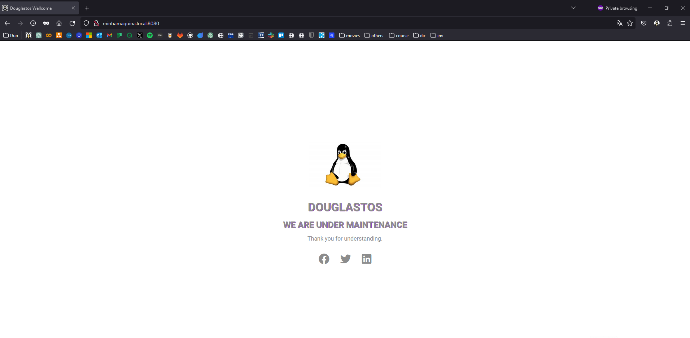

## CODE FOR MAINTENANCE PAGE

Simple code in HTML and CSS with a maintenance page for testing.
The code is with Docker for testing.
To apply it to any server, just point [index.html]() to the apache vhost.

## PREREQUISITES

To carry out a local test of how the page looks, we must have these prerequisites:

- git
- docker 
- docker-compose

## RUN THE CODE

run the following commands:

~~~bash
$ git clone git@gitlab.duosystem.com.br:dsribeiro/manutencao.git
$ cd manutencao/
$ docker-compose up -d
~~~

## RESULTADO
